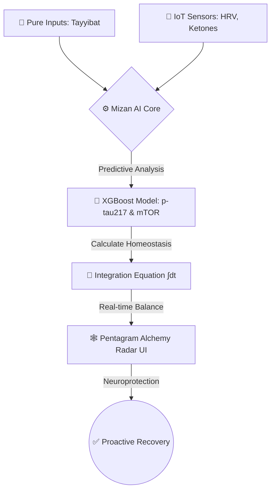

# 🧬 MizanBio: Before Memory Fades

> **The Circular Alchemist Bio-System** — A Cyber-Biological Approach to Neuroprotection

[](https://github.com/)
[](./LICENSE)
[](https://github.com/)
[](https://github.com/)

---

## 🌿 Project Identity

| Component | Description |
|-----------|-------------|
| **MizanBio** | The Technical System & Digital Twin |
| **Before Memory Fades** | The Human Mission & Vision |
| **The Circular Alchemist** | The Restorative Methodology |

---

## 🎬 Experience Our Mission

> The architecture of this project is vast, so we built an **interactive HTML storytelling experience** to preview the human essence of MizanBio.

🔗 **[Watch the full Video & experience the audio on LinkedIn](https://linkedin.com)**

---

## 🧠 The Problem We Solve

Alzheimer's disease is not just a memory disease — it begins **decades before the first symptom**. Current medicine reacts. MizanBio **predicts and prevents**.

---

## 🧬 The Core Concept

MizanBio treats the human body as an **interconnected Bio-Reactor**.

Neurodegenerative risks (**Alzheimer's**) and neurodevelopmental shifts (**Autism**) share a critical link: the breakdown of the **Gut-Brain Axis**.

By restoring **"Pentagram Harmony"** and tracking pure biological inputs (*Tayyibat*), the system enables **proactive self-restoration**.

### The Five Pillars of Pentagram Harmony

```
        🧠 Brain
           ▲
          / \
🫀 Vagus   ⚖️ Gut
  Nerve   /   \
         /     \
    🫁 Liver — 🧫 Colon
```

> Restoring balance across all five organs is the foundation of neuroprotection in MizanBio.

---

## 🧮 The Homeostasis Recovery Equation

Inspired by the holistic clinical research of **Dr. Diaa Al-Awadhi**, we engineered a predictive mathematical model:

$$H_{Recovery} = \int \frac{P_{Tayyibat}}{B_{Metabolic} + I_{Inflammation}} \, dt$$

| Variable | Meaning |
|----------|---------|
| `P_Tayyibat` | Quality score of pure biological inputs |
| `B_Metabolic` | Accumulated metabolic debt |
| `I_Inflammation` | Neuroinflammation index |
| `H_Recovery` | Predicted homeostasis recovery rate |

High-quality inputs reduce metabolic debt and neuroinflammation over time — shifting the body from reactive disease management to **proactive neuroprotection**.

---

## 🛠️ Technical Architecture — "The Assistive Brain"

The cyber-biological feedback loop processes metabolic inputs and translates them into proactive neuroprotection through **three core components**:

### Components

| Component | Function |
|-----------|----------|
| 🔌 **Smart IoT Simulator** | Tracks continuous biomarkers: HRV, hydration, ketones |
| 🤖 **Predictive AI (XGBoost)** | Analyzes early cellular degradation trends: p-tau217 & mTOR |
| 🕸️ **Pentagram Alchemy Radar** | Responsive visual UI showing real-time organ balance |

### Data Flow



---

## 📊 Key Biomarkers Tracked

```
📡 IoT Inputs               🧬 Biological Targets
─────────────────           ──────────────────────
• HRV (Heart Rate           • p-tau217 (early
  Variability)                Alzheimer's marker)
• Hydration Levels          • mTOR Pathway Activity
• Blood Ketone Levels       • Neuroinflammation Index
• Metabolic Inputs          • Gut Microbiome Balance
```

---

## 🗺️ Roadmap

```
Phase 1 ✅  Concept Design & Mathematical Modeling
Phase 2 🔄  Data Validation & Predictive Model Refining  ← Current
Phase 3 🔜  Clinical Pilot & Biomarker Correlation Study
Phase 4 🔜  Digital Twin Integration & Full UI Deployment
Phase 5 🔜  Open Research Publication
```

---

## 📌 Current Development Status

> **Phase:** Data Validation & Predictive Model Refining

> ⚠️ **IP Notice:** To protect proprietary ML architecture and sensitive biomedical data structures, the source code is currently **kept private** during this research validation stage.

---

## 🔬 Research Foundation

This project builds upon:
- Clinical research by **Dr. Diaa Al-Awadhi** on holistic metabolic restoration
- Emerging science on the **Gut-Brain Axis** and neurodegeneration
- Advanced biomarker research on **p-tau217** as an early Alzheimer's predictor
- **mTOR pathway** studies linking metabolic health to neuroinflammation

---

## 🤝 Collaboration & Contact

MizanBio is a research-stage project. We welcome:
- 🧪 Clinical researchers in neuroscience & metabolic medicine
- 📊 Data scientists specializing in biomedical ML
- 🏥 Healthcare institutions for pilot programs
- 💡 Impact investors aligned with preventive healthcare

> 📬 **Interested in collaborating?** [Open an Issue](https://github.com/) or reach out via [LinkedIn](https://linkedin.com).

---

## 📄 License

This project is **proprietary and not open-source** at this stage.  
All rights reserved © MizanBio Research Team.

---

<div align="center">

**MizanBio: Insight Before Memory Fades 🔄🌳💧**

*"The best time to prevent Alzheimer's is decades before it begins."*

</div>
